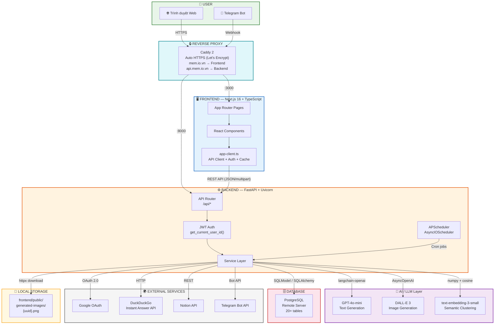
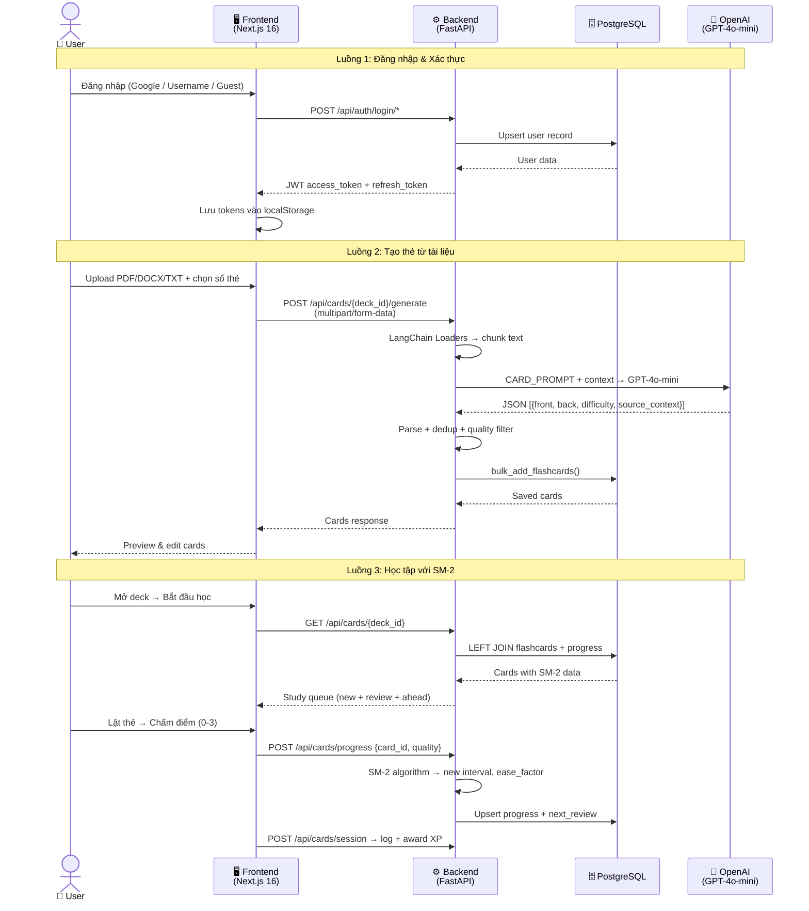
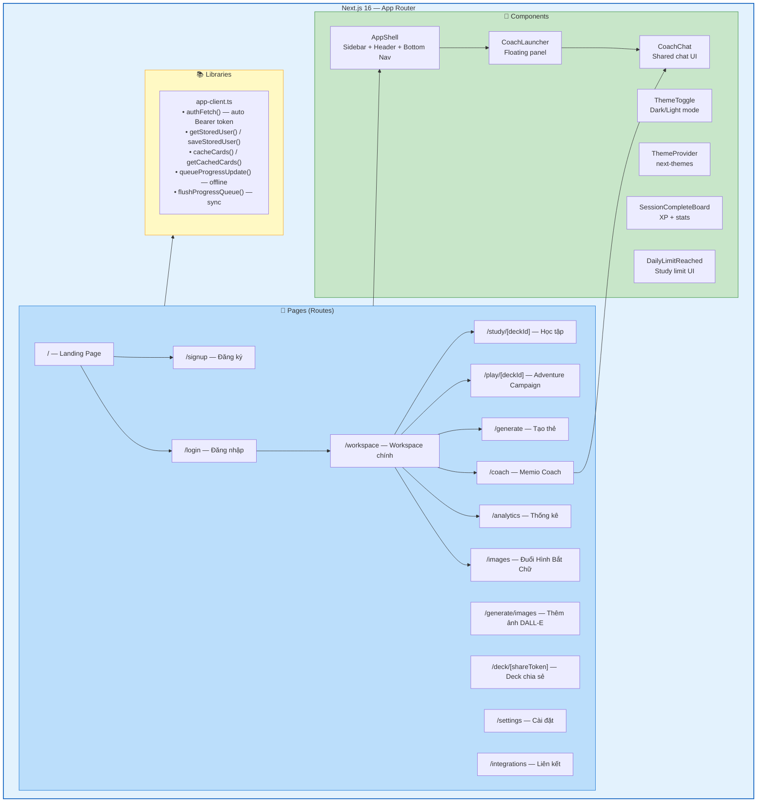
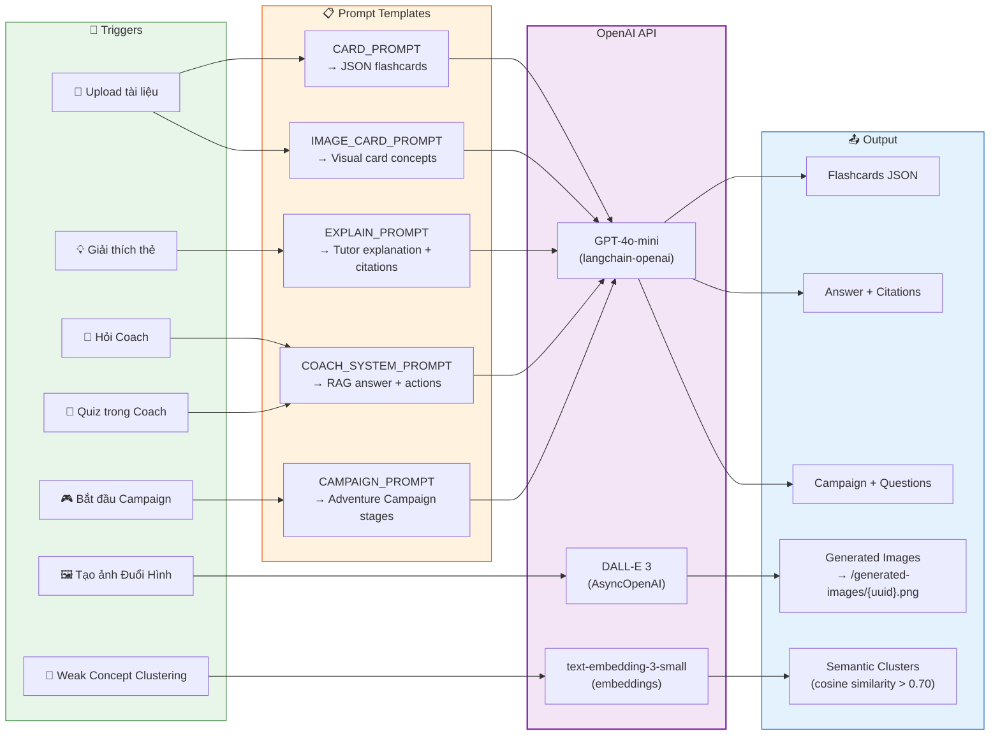
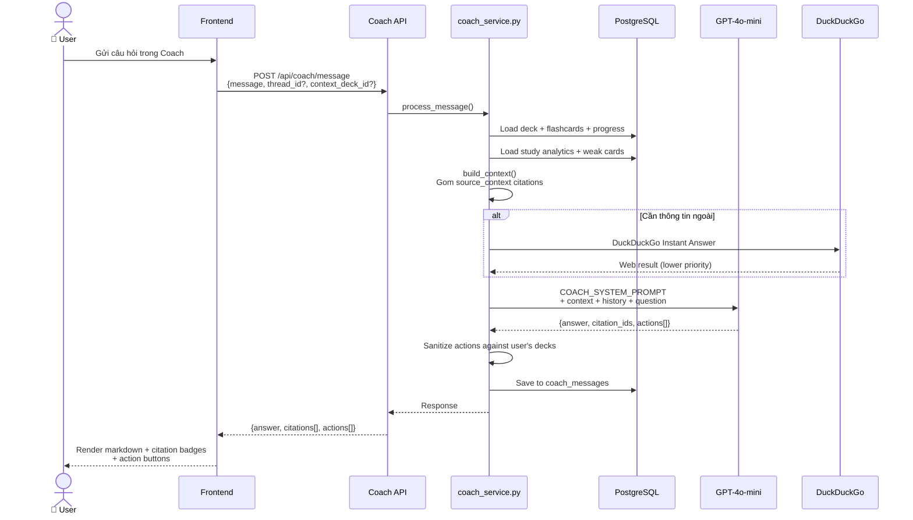
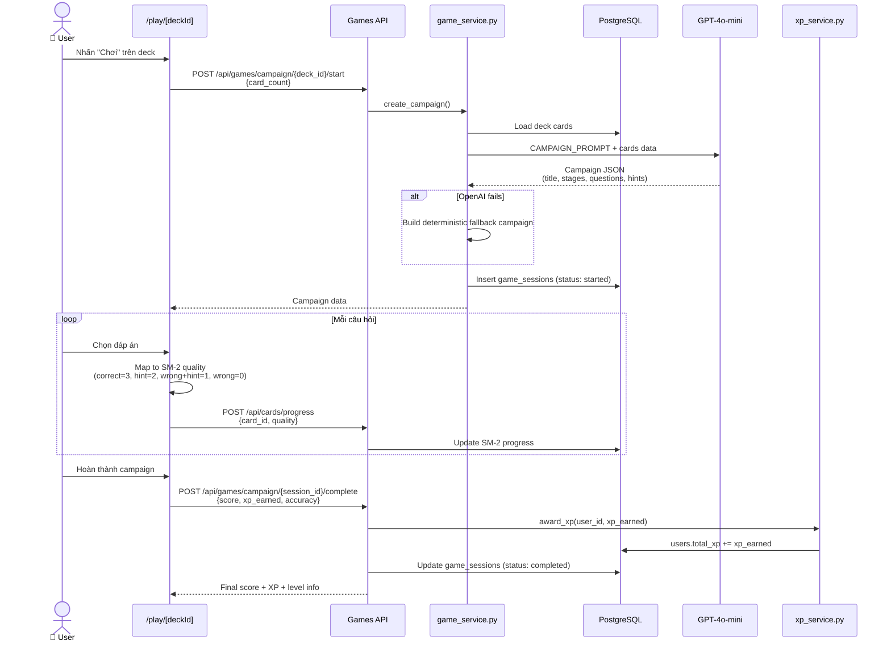
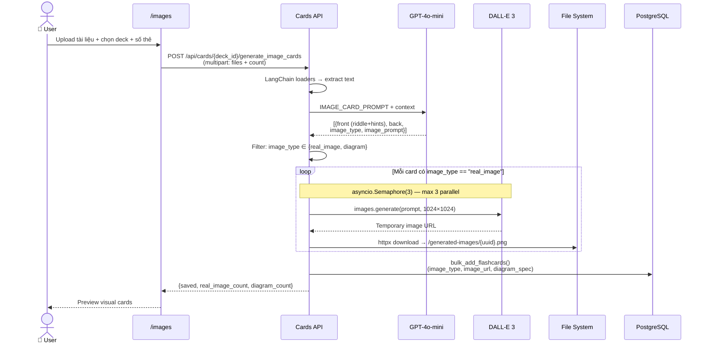
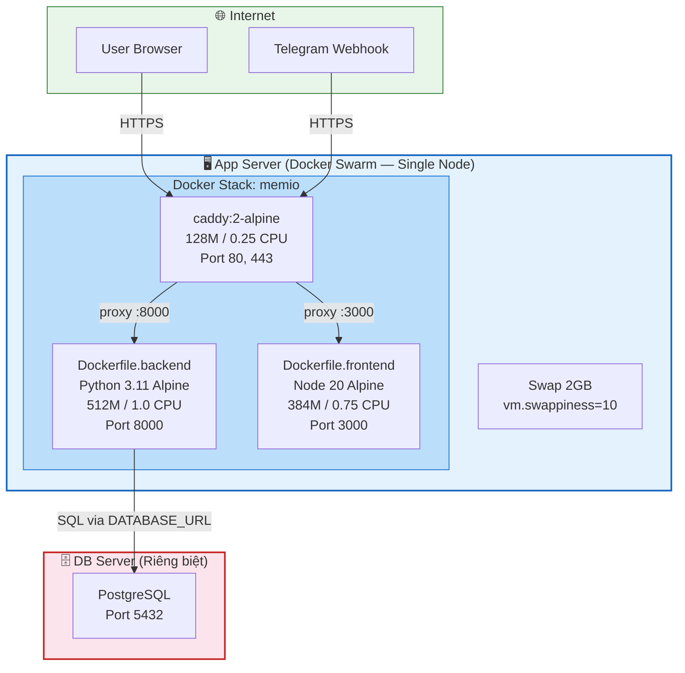

# Memio — System Architecture

> Tài liệu kiến trúc hệ thống: sơ đồ User, Frontend, Backend/API, Database, AI Agent/LLM và luồng dữ liệu chính.

---

## 1. Tổng quan kiến trúc hệ thống

---

## 2. Sơ đồ luồng dữ liệu chính

---

## 3. Frontend Architecture

---

## 4. Backend Architecture

```mermaid
graph TB
    subgraph FASTAPI["FastAPI Backend"]
        Main["main.py<br/>CORS + lifespan + mount /api"]

        subgraph ENDPOINTS["🔌 API Endpoints (/api/*)"]
            AuthEP["auth.py<br/>Login / Register / Guest"]
            DecksEP["decks.py<br/>CRUD + Share + Analytics"]
            CardsEP["cards.py<br/>Generate + Progress + Study"]
            GamesEP["games.py<br/>Adventure Campaign"]
            CoachEP["coach.py<br/>Chat + Quiz + Intelligence"]
            GoalsEP["goals.py<br/>Learning Goals"]
            UsersEP["users.py<br/>Settings + XP"]
            NotifEP["notifications.py<br/>Alerts + Cron trigger"]
            IngestionEP["ingestion.py<br/>Sources pipeline"]
            IntegEP["integrations.py<br/>Telegram / Discord link"]
            NotionEP["notion.py<br/>Notion sync"]
        end

        subgraph SERVICES["🏗️ Service Layer"]
            CardSvc["card_service.py<br/>Study queue + SM-2"]
            CoachSvc["coach_service.py<br/>RAG + context builder"]
            GameSvc["game_service.py<br/>Campaign builder"]
            AnalyticsSvc["analytics_service.py<br/>Streak + heatmap"]
            XPSvc["xp_service.py<br/>Level system (10 levels)"]
            GoalSvc["goal_service.py<br/>Exam deadline planner"]
            NotifSvc["notification_service.py<br/>Due/streak/exam alerts"]
            IngestionSvc["ingestion_service.py<br/>RSS/Notion fetch"]
            DeckSvc["deck_service.py"]
            UserSvc["user_service.py"]
            TelegramSvc["telegram_service.py"]
        end

        subgraph UTILS["🔧 Utilities"]
            SM2["sm2.py<br/>Spaced Repetition Algorithm"]
            Pipeline["card_pipeline.py<br/>Chunking + dedup + filter"]
            ImgGen["image_generator.py<br/>DALL-E 3 + download"]
            JWT["jwt_auth.py<br/>Token create/verify"]
            Security["security.py<br/>Password hashing (bcrypt)"]
        end

        subgraph SCHEDULER["⏰ APScheduler"]
            Job1["send_due_cards<br/>every 5 min"]
            Job2["sync_ingestion<br/>every 10 min"]
            Job3["weekly_report<br/>Mon 08:00"]
        end

        subgraph AUTH["🔐 Auth"]
            Deps["deps.py<br/>get_current_user_id()<br/>JWT Bearer extraction"]
        end
    end

    Main --> ENDPOINTS
    ENDPOINTS --> AUTH
    AUTH --> SERVICES
    SERVICES --> UTILS
    SCHEDULER --> SERVICES

    style FASTAPI fill:#fff3e0,stroke:#e65100,stroke-width:2px
    style ENDPOINTS fill:#ffe0b2,stroke:#ef6c00
    style SERVICES fill:#c8e6c9,stroke:#388e3c
    style UTILS fill:#e1bee7,stroke:#8e24aa
    style SCHEDULER fill:#b3e5fc,stroke:#0288d1
    style AUTH fill:#ffcdd2,stroke:#c62828
```

---

## 5. Database Schema (ER Diagram)

```mermaid
erDiagram
    USERS {
        int id PK
        string google_id UK
        string username UK
        string password_hash
        string name
        string email
        string photo_url
        string auth_type
        bool is_guest
    }

    DECKS {
        int id PK
        int user_id FK
        string name
        string description
        int is_public
        string share_token UK
        datetime created_at
    }

    FLASHCARDS {
        int id PK
        int deck_id FK
        string front
        string back
        string difficulty
        string source_context
        string image_type
        string image_url
        string diagram_spec
        datetime created_at
    }

    PROGRESS {
        int id PK
        int user_id FK
        int card_id FK
        int interval
        int repetition
        float ease_factor
        int last_quality
        string last_reviewed
        string next_review
    }

    STUDY_SESSIONS {
        int id PK
        int user_id FK
        int deck_id FK
        string session_date
        int cards_reviewed
        float avg_quality
    }

    GAME_SESSIONS {
        int id PK
        int user_id FK
        int deck_id FK
        string mode
        string status
        string campaign_json
        int score
        int xp_earned
        float accuracy
        datetime started_at
        datetime completed_at
    }

    COACH_THREADS {
        int id PK
        int user_id FK
        int context_deck_id FK
        string title
        datetime created_at
        datetime updated_at
    }

    COACH_MESSAGES {
        int id PK
        int thread_id FK
        int user_id FK
        string role
        string content
        string citations_json
        string actions_json
        datetime created_at
    }

    USER_SETTINGS {
        int id PK
        int user_id FK
        int daily_new_limit
        int daily_review_limit
        string timezone
    }

    LEARNING_GOALS {
        int id PK
        int user_id FK
        int deck_id FK
        string goal_type
        string target_date
        int desired_mastery
        int daily_workload
        string status
    }

    AUTH_SESSIONS {
        int id PK
        int user_id FK
        string refresh_token_hash
        string device_name
        datetime created_at
        datetime revoked_at
    }

    CHAT_INTEGRATIONS {
        int id PK
        int user_id FK
        string provider
        string provider_user_id
        string dm_chat_id
        string timezone
        string send_window
        int daily_goal
    }

    LINK_CODES {
        int id PK
        string code UK
        string provider
        string provider_user_id
        datetime expires_at
    }

    OAUTH_CONNECTIONS {
        int id PK
        int user_id FK
        string provider
        string access_token
        string workspace_id
    }

    INGESTION_SOURCES {
        int id PK
        int user_id FK
        string provider
        string name
        string status
        int target_deck_id FK
    }

    INGESTION_ITEMS {
        int id PK
        int source_id FK
        string title
        string content_text
        string checksum
    }

    INGESTION_RUNS {
        int id PK
        int source_id FK
        string status
        int fetched_count
        int created_count
    }

    INGESTION_CARD_MAPS {
        int id PK
        int ingestion_item_id FK
        int flashcard_id FK
    }

    EXTERNAL_NOTES {
        int id PK
        int source_id FK
        string external_note_id
        string title
        string content_text
    }

    INGESTION_CURSORS {
        int id PK
        int source_id FK
        string cursor_type
        string cursor_value
    }

    USERS ||--o{ DECKS : "owns"
    USERS ||--o{ PROGRESS : "tracks"
    USERS ||--o{ STUDY_SESSIONS : "logs"
    USERS ||--o{ GAME_SESSIONS : "plays"
    USERS ||--o{ COACH_THREADS : "chats"
    USERS ||--o{ USER_SETTINGS : "configures"
    USERS ||--o{ LEARNING_GOALS : "sets"
    USERS ||--o{ AUTH_SESSIONS : "authenticates"
    USERS ||--o{ CHAT_INTEGRATIONS : "links"
    USERS ||--o{ OAUTH_CONNECTIONS : "connects"
    USERS ||--o{ INGESTION_SOURCES : "subscribes"
    DECKS ||--o{ FLASHCARDS : "contains"
    DECKS ||--o{ LEARNING_GOALS : "targets"
    FLASHCARDS ||--o{ PROGRESS : "measured_by"
    COACH_THREADS ||--o{ COACH_MESSAGES : "holds"
    INGESTION_SOURCES ||--o{ INGESTION_ITEMS : "fetches"
    INGESTION_SOURCES ||--o{ INGESTION_RUNS : "executes"
    INGESTION_SOURCES ||--o{ EXTERNAL_NOTES : "stores"
    INGESTION_SOURCES ||--o{ INGESTION_CURSORS : "bookmarks"
    INGESTION_ITEMS ||--o{ INGESTION_CARD_MAPS : "maps_to"
    FLASHCARDS ||--o{ INGESTION_CARD_MAPS : "created_from"
```

---

## 6. AI Agent / LLM Integration

---

## 7. Luồng dữ liệu chi tiết theo feature

### 7.1 Luồng Memio Coach (RAG)

### 7.2 Luồng Adventure Campaign

### 7.3 Luồng Image Flashcard (Đuổi Hình Bắt Chữ)

---

## 8. Deployment Architecture

**Deploy flow:**
1. **One-time:** `sudo bash scripts/bootstrap.sh` → Docker check, swap 2GB, UFW 80/443, swarm init
2. **Daily:** `bash scripts/redeploy.sh` → `docker compose build` → `docker stack deploy -c docker-stack.yml memio`

---

## 9. Tech Stack Summary

| Layer | Technology | Chi tiết |
|-------|-----------|----------|
| **Frontend** | Next.js 16 + TypeScript | App Router, Tailwind CSS 3.4, Radix UI, Lucide Icons |
| **Styling** | Tailwind CSS + CSS Variables | `next-themes` (dark/light), design tokens trong `tailwind.config.js` |
| **Backend** | FastAPI + Uvicorn | Python 3.11, ASGI, lifespan context manager |
| **ORM** | SQLModel (SQLAlchemy + Pydantic) | Pydantic V2 (`model_dump()`), Alembic migrations |
| **Database** | PostgreSQL | 20+ tables, remote server, managed via Alembic |
| **AI — Text** | GPT-4o-mini via `langchain-openai` | Card gen, Coach RAG, Campaign, Explain |
| **AI — Image** | DALL-E 3 via `AsyncOpenAI` | 1024×1024, ~$0.04/ảnh, semaphore(3) |
| **AI — Embed** | text-embedding-3-small | Semantic clustering, cosine similarity > 0.70 |
| **Auth** | JWT Bearer + Google OAuth | `authFetch()` auto-attach, refresh on 401 |
| **Scheduler** | APScheduler (AsyncIOScheduler) | In-process, due cards (5m), ingestion (10m), weekly report |
| **Reverse Proxy** | Caddy 2 Alpine | Auto HTTPS via Let's Encrypt |
| **Containerization** | Docker Compose + Docker Swarm | Multi-stage Alpine images, rolling update |
| **External** | Telegram Bot API, Notion API, DuckDuckGo | Notifications, ingestion, web search fallback |
