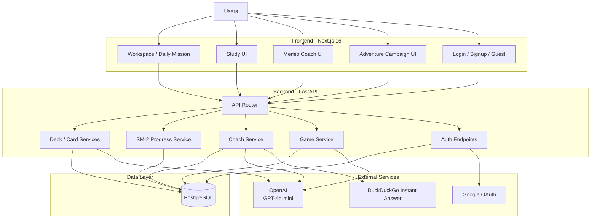
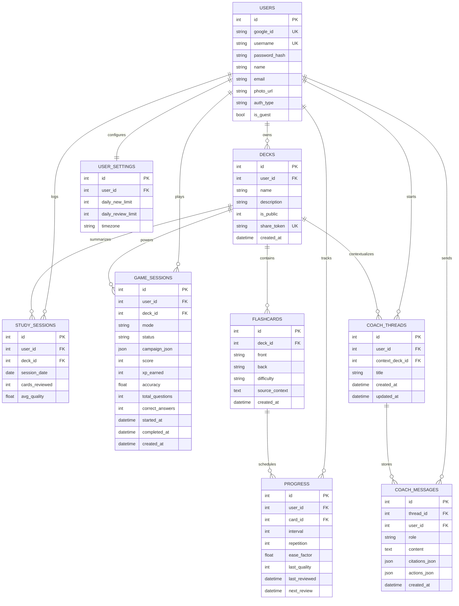
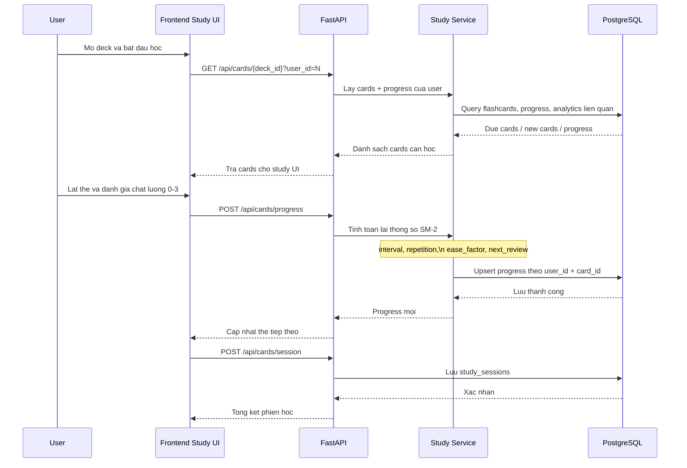

# Bieu do thiet ke du an Memio

Tai lieu nay tong hop cac bieu do Mermaid de mo ta dung kien truc, mo hinh du lieu, va cac luong chinh cua Memio theo trang thai pilot hien tai.

## 1. Kien truc he thong

## 2. ER diagram

## 3. Luong hoc va cap nhat SM-2

## 4. Luong tao the va coach

```mermaid
flowchart LR
    Upload[Upload PDF / DOCX / TXT] --> Extract[Extract text]
    Extract --> Chunk[Chunk tai lieu theo lo]
    Chunk --> Prompt[Build card prompt]
    Prompt --> LLM[OpenAI GPT-4o-mini]
    LLM --> Preview[Preview cards JSON]
    Preview --> Review[User review / edit]
    Review --> Save[Save flashcards]
    Save --> StudyReady[Deck san sang hoc]

    StudyReady --> CoachAsk[User hoi Memio Coach]
    CoachAsk --> CoachAPI[POST /api/coach/message]
    CoachAPI --> Internal[Lay deck, card, progress, analytics noi bo]
    Internal --> CoachLLM[OpenAI Coach prompt]
    CoachAPI --> WebFallback[DuckDuckGo fallback khi can web/latest]
    CoachLLM --> CoachReply[Answer + citations + actions]
    WebFallback --> CoachReply
```

