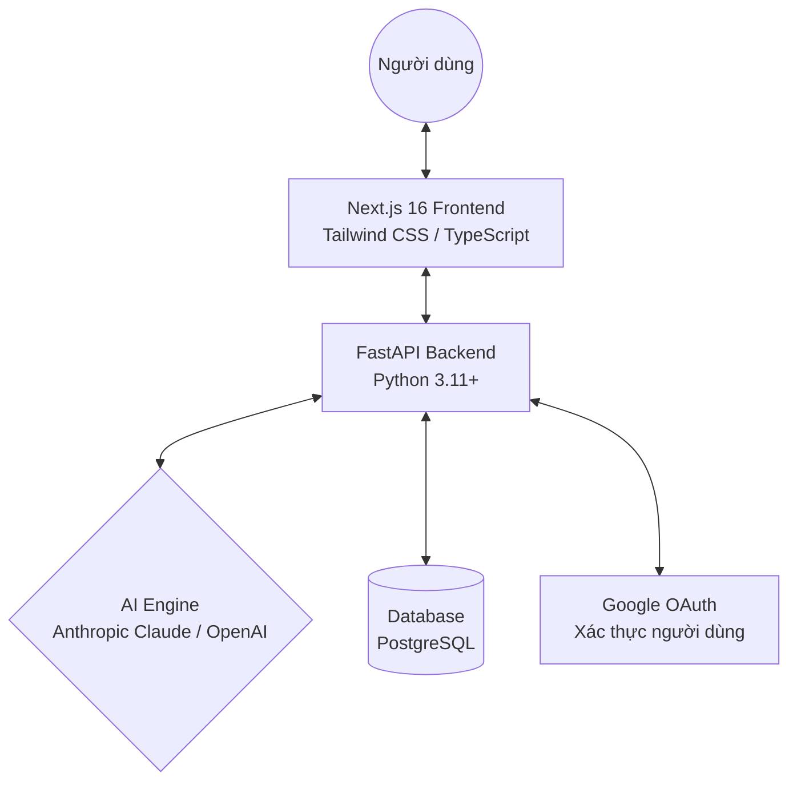
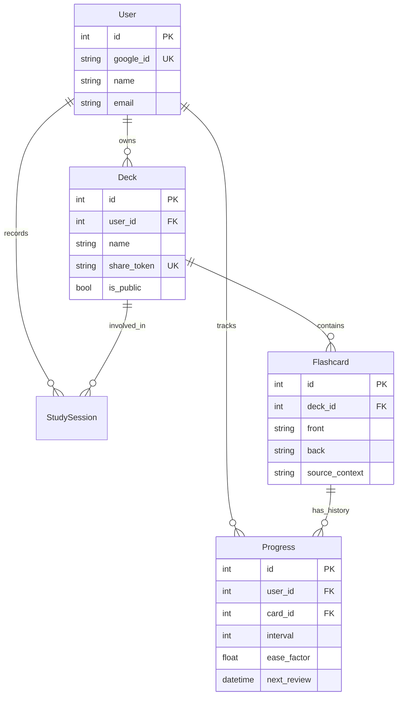
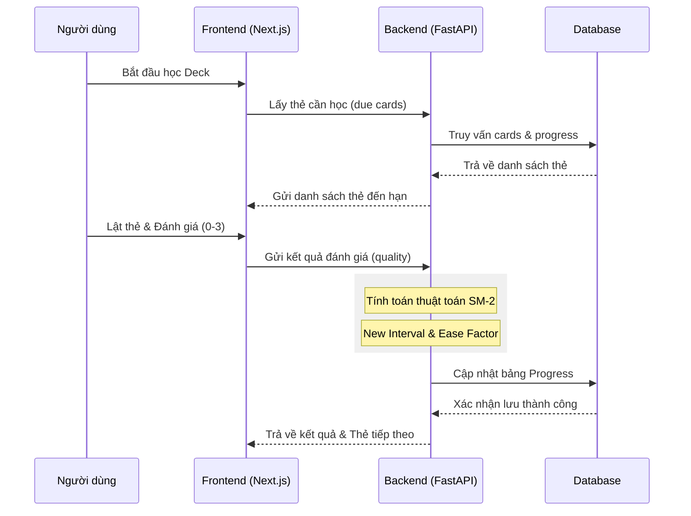
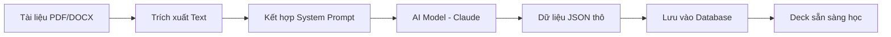

# Biểu đồ thiết kế dự án Memio

Dưới đây là các biểu đồ Mermaid giúp bạn hình dung kiến trúc, cấu trúc dữ liệu và quy trình hoạt động của dự án Memio.

## 1. Kiến trúc hệ thống (System Architecture)

Biểu đồ này mô tả cách các thành phần trong hệ thống tương tác với nhau.

---

## 2. Mô hình thực thể - quan hệ (ER Diagram)

**cấu trúc cơ sở dữ liệu**

---

## 3. Quy trình ôn tập (Study Flow - SM-2)

**luồng xử lý khi người dùng học một thẻ và hệ thống tính toán thời gian ôn tập tiếp theo.**

---

## 4. Quy trình tạo thẻ bằng AI (AI Generation Flow)

